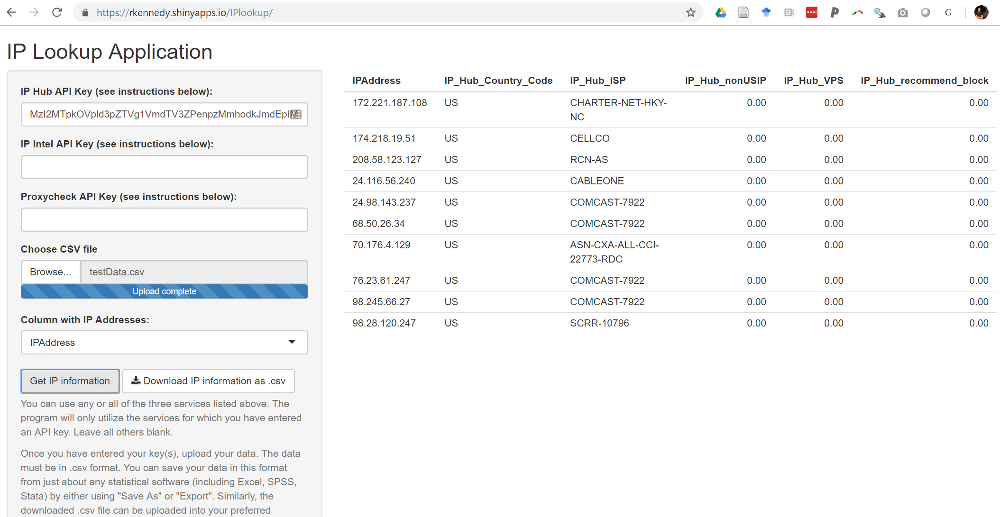
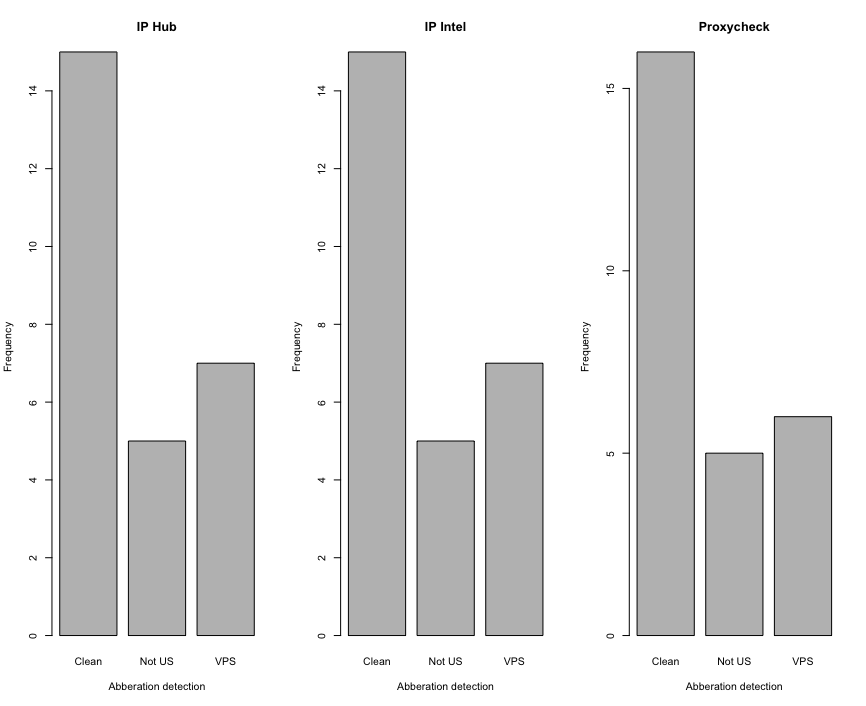

# Summary

Amazon's Mechanical Turk (MTurk) and other online convenience samples are used in thousands of published social science studies every year. One survey estimated that, in 2015 alone, over 1,200 published studies used MTurk ([@bohannon:2016]).  Another found that over 40% of studies in two top psychology journals in 2015 included at least one MTurk experiment ([@Zhou:2016]). Many recent studies have validated the use of MTurk to address substantive questions of interest in the social sciences (e.g., [@clifford:2015], [@huff:2015], [@casler:2013], [@buhrmester:2011]). Because of this, recent reports of widespread fraudulent responses on MTurk, up to 25% of respondents in some studies, set off a panic in academia ([@dreyfuss:2018], [@ahler:2018]). The problem has been traced to the use of Virtual Private Servers (VPS) to answer U.S. surveys from abroad ([@dennis:2018], [@TurkPrime:2018]), and may have affected studies as far back as 2015 ([@kennedy:2018]). Yet, the tools available to social scientists to check their surveys for VPS use and non-U.S. respndents are not easily usable for most researchers; some are outdated and involve Python programming [(@ahler:2018)], while other require researchers to paste IP Addresses in one at a time [(@dennis:2018)]. As more research moves online using services like MTurk, CrowdFlower, and Luc.id, there is a need for tools to check IP Addresses that fit into standard social science research flow.

The R package [@team:2000] `rIP` is dedicated to helping researchers fix this problem by offering an intuitive, simple-to-use function to trace, score, and visualize the location and validity of any IP address by pinging up to three IP verification services (<https://iphub.info>, <https://getipintel.net>, and <https://proxycheck.io/>). The function returns the information on the IP, including the country of the IP address, internet service provider (ISP) and whether the IP address is likely a server farm being used to disguise the respondent's location. It also provides recommendations for exclusion based on the recommendations of the current literature [(@kennedy:2018, @TurkPrime:2018, @Dennis:2018)], and optional plots that can be used in supporting information. These respondents can then be excluded from analysis, though the decision to include or exclude respondents is left to the researcher. Though the package was designed in response to the scare about MTurk quality regarding IP addresses and server farms, users can use the function to check any vector of IP addresses of interest. Since almost every online survey and application development system allows for the capture of IP addresses, this package can be used as an auditing tool on almost any online survey. The implications of this become clearer in the package demonstration below.

For use, users simply need to call the function, `getIPinfo`, and include up to five pieces of information: the data frame storing the IP addresses to be checked, the name of the column or variable in quotation marks corresponding with the IP addresses within the dataset, the API keys for the services they wish to use in quotation marks. Running the `getIPinfo` function returns a data frame with up to 16 pieces of information: the IP address, country code, internet service provider (ISP), a marker variable for non-U.S. locations, a marker variable for likely VPS use, and a marker for whether that respondent should be excluded from analysis (under standards outlined in [(@kennedy:2018, @TurkPrime:2018, @Dennis:2018)]) for up to three IP verification services. One of the services, <https://getipintel.net>, does not provide ISP, but does provide a probability estimate that the IP is from a server farm that is returned instead. By default, the function also returns a plot indicating the proportion of responses from outside the U.S., the proportion inside the U.S. using VPS, and the number considered "clean." This can be turned off by setting the `plots` argument to `FALSE`, as the default is `TRUE`. `rIP` also handles ancillary tasks for the user, like verifying that IP addresses are valid and data types work with the dependencies.

The flexibility of the `rIP` package's reporting is essential for researchers, allowing them to adapt to different inclusion/exclusion criteria and to desired false positive/false negative tolerance, while also providing evidence-based defaults.

Importantly, `rIP` requires API keys from any of the services the researcher wishes to use. Users can register for a free keys that allows for up to 1,000 IP inquiries per day from IP Hub and proxycheck.io, with larger limits available by subscription. IP Intelligence is a free service, but it asks that users do not excede 500 queries per day or 15 queries per minute (`rIP` includes a pause for this service to abide by the recommended limit). 

For examples and more details on syntax, we refer users to the package documentation. The function was designed with non-programmers in mind to facilitate simple and clear usage to help any researcher audit, diagnose, and ameliorate the potential of "farmers" infiltrating online surveys.

For potential users who are not familiar with R, we also provide an online Shiny application that allows the user to enter the keys for any services they want to use and a .csv file of their data, and returns the IP information and the associated plots. This service is available at <https://rkennedy.shinyapps.io/IPlookup/>. Below is a screenshot of the Shiny app:



Now, consider a brief demonstration of the function, using anonymized IP addresses from a recent MTurk survey. For simplicity and safety, we only present the _output_ after running the function, given the need for users to supply personal keys in the function.

```R
# Load some packages
library(devtools) # load devtools to use "install_github()"
install_github("MAHDLab/rIP", force=TRUE) # load the latest version of the package
library(rIP) # load the library

# Load the data
data <- read.csv("iphubInfo.csv") # Read in data where IP addresses are stored

par(mfrow=c(1,3)) # Set pane space for all three in a single pane once function runs

# Run the function
getIPinfo(data, "IPAddress", # Specify df and ip vector from df
          "iphub_key HERE", "ipintel_key HERE", "proxycheck_key HERE", # Keys for the IP services
          plots = TRUE) # Specify whether you want a barplot returned with the output
```

The above code will generate the following output:



\newpage

# Package Access

The `rIP` package can be downloaded from CRAN or, for the most recent version, installed directly from the source code freely accessible at the corresponding GitHub repository along with all package documentation and an issue tracker. The latter option for access is demonstrated in the code above.

\newpage

# Acknowledgements

We thank Tyler Burleigh for pointing out the utility of iphub. This research is based upon work supported in part by the Office of the Director of National Intelligence (ODNI), Intelligence Advanced Research Projects Activity (IARPA), via 2017-17061500006. The views and conclusions contained herein are those of the authors and should not be interpreted as necessarily representing the official policies, either expressed or implied, of ODNI, IARPA, or the U.S. Government. The U.S. Government is authorized to reproduce and distribute reprints for governmental purposes notwithstanding any copyright annotation therein.

# References
